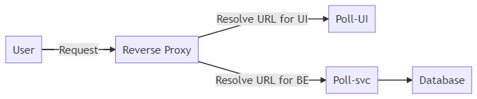

Container 101 - Demo App
========================

Simple demo for Container 101 presentation 

## Tools 

* [Docker](https://docs.docker.com/engine/install/)
* [Docker-Compose](https://docs.docker.com/compose/install/)


## Diagram




## Built With

* Reverse Proxy: [Traefik](https://containo.us/traefik/) 
* Poll-UI: [Angular 7](https://angular.io/) 
* Poll-svc: [Spring Boot](https://spring.io/projects/spring-boot) 
* Database: [MongoDB](https://www.mongodb.com/) 

## Build the Applications/Images

```shell
docker-compose build
```

## Run the Application

```shell
docker-compose up -d 
```
